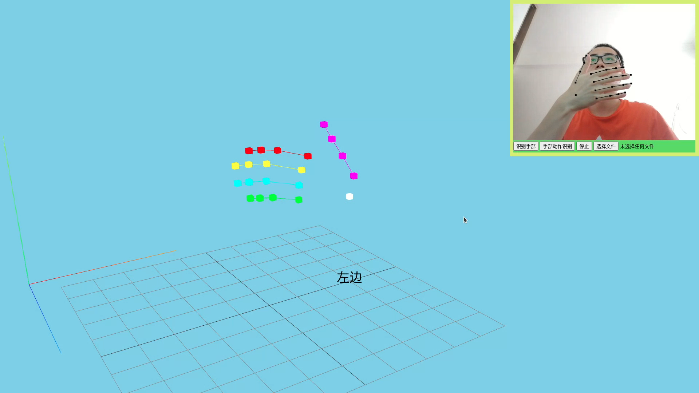
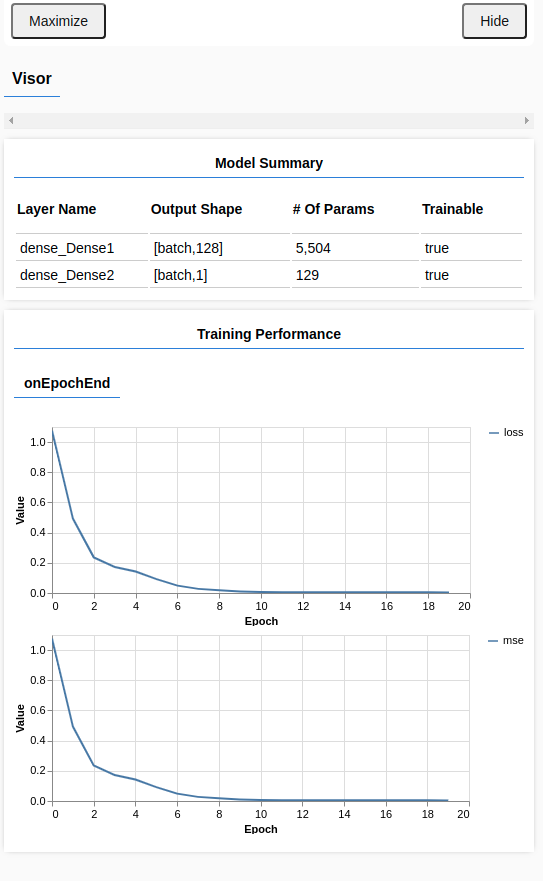

# hand_tracking
浏览器端手部追踪

## 简单安装
```
npm i
npm start
```

## 简单介绍


使用Three.js建立一个三维场景，用于展示3D手部，右上角是摄像头捕捉到的图片，展示2D的手部，点击识别手部开始识别手部，将会展示2D和3D的手部。其中3D场景可以使用鼠标左键旋转，右键平移，滚轮缩放。

如果需要手部动作识别，需要先训练模型。首先F12打开控制台，按a记录代表左边的手势，按d记录代表右边的手势，按s下载数据。然后在选择文件按钮中选择下载的文件，将会自动开始训练，将会跳出训练曲线并把模型保存到localstorage中，然后按手部动作识别可开始动作识别。



# todo

1. 尝试其他手势的识别，比如石头剪刀布、数字等。
2. 尝试使用手势来控制一个threejs平台的游戏。
